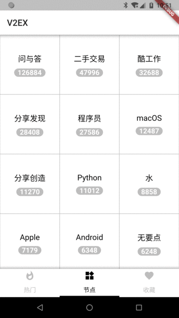
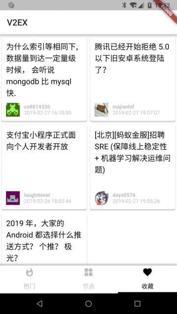
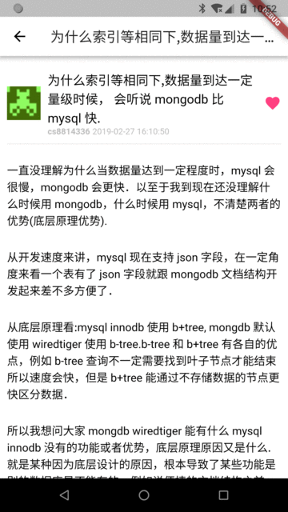

# dwarf_doc

用Flutter写的简单V2EX客户端，实现了基本的帖子浏览的功能，新增本地的收藏功能。

整体为简单的MVP结构。

**1.0.1**

添加首页的下拉刷新逻辑。

用到的开源库：

* dio Http请求
* fluro 路由
* flutter_html 简单HTML页面的渲染
* rxdart Rx
* intl 格式化日期
* url_launcher 打开URL
* sqflite SQLite数据库
* event_bus 事件收发

## Capture

## API

API接口来自[这里](https://github.com/djyde/V2EX-API)

列表相关的分页参数好像都是无效的，要是有知道的同学告诉我一下哈

## Getting Started

This project is a starting point for a Flutter application.

A few resources to get you started if this is your first Flutter project:

- [Lab: Write your first Flutter app](https://flutter.io/docs/get-started/codelab)
- [Cookbook: Useful Flutter samples](https://flutter.io/docs/cookbook)

For help getting started with Flutter, view our 
[online documentation](https://flutter.io/docs), which offers tutorials, 
samples, guidance on mobile development, and a full API reference.
